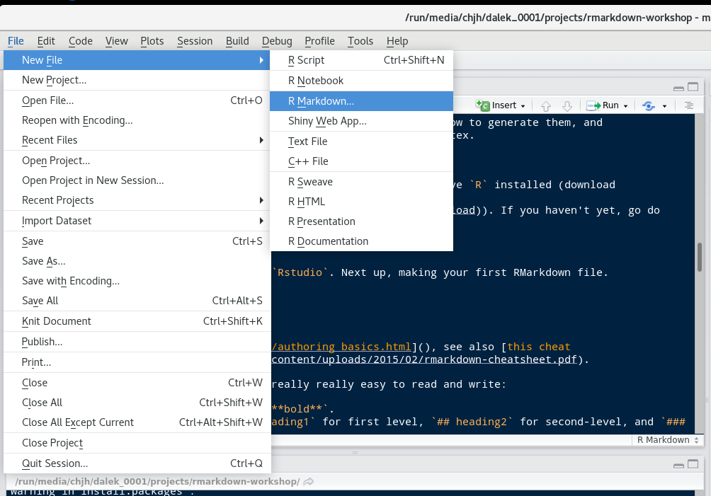

```{r, echo=FALSE}
library(knitr)
opts_chunk$set(fig.width=4, fig.height=3, 
               echo=TRUE, 
               warning=FALSE, message=FALSE, 
               cache=TRUE)
```


# Introduction

This document is a short tutorial on using RMarkdown to mix prose and code together for creating reproducible scientific documents.^[There is also a slidedeck that goes along with this handout available **[here](https://libscie.github.io/rmarkdown-workshop)**, which is worth looking at if you don't know what you're doing on this page and what to look at. Going through this document takes at most two hours, assuming you already know some basic `R` programming. If you find any errors and have a Github account, **[please suggest changes here](https://github.com/libscie/rmarkdown-workshop/edit/master/handout.Rmd)**. All **[content](https://github.com/libscie/rmarkdown-workshop)** is CC 0 licensed, so feel free to remix and reuse!]

The tutorial is based on documents that both Chris and Mike wrote independently (see [here](https://elifesciences.org/labs/cad57bcf/composing-reproducible-manuscripts-using-r-markdown) and [here](http://babieslearninglanguage.blogspot.com/2015/11/preventing-statistical-reporting-errors.html) if you're interested). In short: RMarkdown allows you to create documents that are compiled with code, producing your next scientific paper.^[Note: this is also possible for Python and other open-source data analysis languages, but we focus on R.]

Now we're together trying to help spread the word, because it can make writing manuscripts so much easier! We wrote this handout in RMarkdown as well (looks really sweet, no?).

## Who is this aimed at?

We aim this document at anyone writing manuscripts and using R, including those who...

1. ...collaborate with people who use Word
2. ...want to write complex equations
3. ...want to be able to change bibliography styles with less hassle
4. ...want to spend more time actually doing research!

## Why write reproducible papers?

Cool, thanks for sticking with us and reading up through here!

There are three reasons to write reproducible papers. To be right, to be reproducible, and to be efficient. There are more, but these are convincing to us. In more depth:

1. To avoid errors. Using an automated method for scraping APA-formatted stats out of PDFs, @nuijten2016 found that over 10% of p-values in published papers were inconsistent with the reported details of the statistical test, and 1.6% were what they called "grossly" inconsistent, e.g. difference between the p-value and the test statistic meant that one implied statistical significance and the other did not. Nearly half of all papers had errors in them. 

2. To promote computational reproducibility. Computational reproducibility means that other people can take your data and get the same numbers that are in your paper. Even if you don't have errors, it can still be very hard to recover the numbers from published papers because of ambiguities in analysis. Creating a document that literally specifies where all the numbers come from in terms of code that operates over the data removes all this ambiguity.

3. To create spiffy documents that can be revised easily. This is actually a really big neglected one for us. At least one of us used to tweak tables and figures by hand constantly, leading to a major incentive *never to rerun analyses* because it would mean re-pasting and re-illustratoring all the numbers and figures in a paper. That's a bad thing! It means you have an incentive to be lazy and to avoid redoing your stuff. And you waste tons of time when you do. In contrast, with a reproducible document, you can just rerun with a tweak to the code. You can even specify what you want the figures and tables to look like before you're done with all the data collection (e.g., for purposes of preregistraion or a registered report). 

## Learning goals

By the end of this class you should:

* Know what Markdown is and how the syntax works, 
* See how to integrate code and data in RMarkdown, 
* Understand the different output formats from RMarkdown and how to generate them, and
* Know about generating APA format files with `papaja` and bibtex.

# Getting Started

## Installation

Before we get started with running everything, make sure to have `R` installed (download [here](https://cran.r-project.org/)) and `Rstudio` (download [here](https://www.rstudio.com/products/rstudio/download/#download)). If you haven't yet, go do that first and we'll be here when you get back!

## Exercise

Great, you installed both `R` and `Rstudio`! Next up, making your first RMarkdown file.

Fire up Rstudio and create a new RMarkdown file. Don't worry about the settings, we'll get to that later.

```{r, echo = FALSE, fig.width=4}

```

If you click on "Knit" (or hit `CTRL+SHIFT+K`) the RMarkdown file will run and generate all results and present you with a PDF file, HTML file, or a Word file. If RStudio requests you to install packages, click yes and see whether everything works to begin with. 

We need that before we teach you more about RMarkdown. But you should feel good if you get here already, because honestly, you're about 80% of the way to being able to write basic RMarkdown files. It's _that_ easy.

# Structure of an RMarkdown file

An RMarkdown file contains several parts. Most essential are the header, the body text, and code chunks.

## Header

Headers in RMarkdown files contain some metadata about your document, which you can customize to your liking. Below is a simple example that purely states the title, author name(s), date^[Pro-tip: you can use the `Sys.Date()` function to have that use the current date when creating the document.], and output format.

```yaml
---
title: "Untitled"
author: "NAME"
date: "July 28, 2017"
output: html_document
---
```

For now, go ahead and set `html_document` to `word_document`, except if you have strong preferences for `HTML` or `PDF`.^[Note: to create PDF documents you also need a TeX installation. Don't know what that is? You probably don't have it then.]

## Body text

The body of the document is where you actually write your reports. This is primarily written in the Markdown format, which is explained in the [Markdown syntax](#markdown-syntax) section.

The beauty of RMarkdown is, however, that you can evaluate `R` code right in the text. To do this, you start inline code with \`r, type the code you want to run, and close it again with a \`. Usually, this key is below the escape (`ESC`) key  or next to the left SHIFT button.

For example, if you want to have the result of 48 times 35 in your text, you type \` r 48-35\`, which returns `r 48 - 35`. Please note that if you return a value with many decimals, it will also print these depending on your settings (for example, `r pi`).

## Code chunks

In the section above we introduced you to running code inside text, but often you need to take several steps in order to get to the result you need. And you don't want to do data cleaning in the text! This is why there are code chunks. A simple example is a code chunk loading packages. 

First, insert a code chunk by going to `Code->Insert code chunk` or by pressing `CTRL+ALT+I`. Inside this code chunk you can then type for example, `library(ggplot2)` and create an object `x`. 

```{r}
library(ggplot2)

x <- 1 + 1
```

If you do not want to have the contents of the code chunk to be put into your document, you include `echo=FALSE` at the start of the code chunk. We can now use the contents from the above code chunk to print results (e.g., $x=`r x`$).

These code chunks can contain whatever you need, including tables, and figures (which we will go into more later). Note that all code chunks regard the location of the RMarkdown as the working directory, so when you try to read in data use the relative path in.

## Exercises

Switch over to your new RMarkdown file.

1. Create a code chunk. In it, use `write.csv(USArrests, "USArrests.csv")` to write out some data to your hard drive. Subsequently, find that file on your computer. Where is it?^[RMarkdown files operate out of the directory in which they are located. If you read in data, it's important to write paths relatively starting from that "project root" directory, instead of absolute -- otherwise when you share the file the paths will all be wrong. Similarly, if you write out data they go in the root directory.]
2. Load the `ggplot2` package (or any other that you use frequently) in a code chunk and regenerate the document. Now try load some packages you've never heard of, like `adehabitatHS` or `QCA`. What happens?^[We like to load all our packages at the top of the document so it's easy to know what you need to install to make it run.]

<!-- 4. Force RMarkdown to install packages that the user doesn't yet have when the document is generated. -->

# Markdown syntax

Markdown is one of the simplest document languages around, that is an open standard and can be converted into `.tex`, `.docx`, `.html`, `.pdf`, etc. This is the main workhorse of RMarkdown and is very powerful. You can [learn Markdown in five (!) minutes](https://learnxinyminutes.com/docs/markdown/) Other resources include [http://rmarkdown.rstudio.com/authoring_basics.html](), and [this cheat sheet](https://www.rstudio.com/wp-content/uploads/2015/02/rmarkdown-cheatsheet.pdf). 

You can do some pretty cool tricks with Markdown, but these are the basics:

* It's easy to get `*italic*` or `**bold**`. 
* You can get headings using `# heading1` for first level, `## heading2` for second-level, and `### heading3` for third level. 
* Lists are delimited with `*` for each entry.
* You can write links by writing `[here's my link](http://foo.com)`.

If you want a more extensive description of all the potential of Markdown, [this introduction to Markdown](https://daringfireball.net/projects/markdown/) is highly detailed.

## Exercises

Swap over to your new sample markdown.

1. Outlining using headings is a really great way to keep things organized! Try making a bunch of headings, and then recompiling your document. 
2. Add a table of contents. This will involve going to the header of the document (the `YAML`), and adding some options to the `html document` bit. You want it to look like this (indentation must to be correct):

```yaml
output: 
html_document:
toc: true
```

Now recompile. Looks spiffy, right?^[Pro-tip: you can specify how deep the TOC should go by adding `toc_depth: 2` to go two levels deep]

3. Try adding another option: `toc_float: true`. Recompile -- super spiffy. There are plenty more great output options that you can modify. [Here is a link to the documentation.](http://rmarkdown.rstudio.com/html_document_format.html)

# Adding more code (Tables and Graphs)

We're going to want more libraries loaded (for now we're loading them inline). 

```{r}
library(knitr)
library(ggplot2)
library(broom)
library(devtools)
```

We often also add `chunk options` to each code chunk so that, for example:

- code does or doesn't display inline (`echo` setting)
- figures are shown at various sizes (`fig.width` and `fig.height` settings)
- warnings and messages are suppressed (`warning` and `message` settings)
- computations are cached (`cache` setting)

There are many others available as well. Caching can be very helpful for large files, but can also cause problems when there are external dependencies that change. An example that is useful for manuscripts is

```{r eval=FALSE}
opts_chunk$set(fig.width=8, fig.height=5, 
               echo=TRUE, 
               warning=FALSE, message=FALSE, 
               cache=TRUE)
```


## Graphs

It's really easy to include graphs, like this one. (Using the `mtcars` dataset that comes with `ggplot2`).

```{r}
qplot(hp, mpg, col = factor(cyl), data = mtcars)
```

All you have to do is make the plot and it will render straight into the text. 

External graphics can also be included, as follows:

```{r eval = FALSE}
knitr::include_graphics("path/to/file")
```

## Tables

There are many ways to make good-looking tables using RMarkdown, depending on your display purpose. 

- The `knitr` package (which powers RMarkdown) comes with the `kable` function. It's versatile and makes perfectly reasonable tables. It also has a `digits` argument for controlling rounding. 
- For HTML tables, there is the `DT` package, which provides `datatable` -- these are pretty and interactive javascript-based tables that you can click on and search in. Not great for static documents though. 
- For APA manuscripts, it can also be helpful to use the `xtable` package, which creates very flexible LaTeX tables. These can be tricky to get right but they are completely customizable provided you want to google around and learn a bit about tex. 

We recommend starting with `kable`:


```{r}
kable(head(mtcars), digits = 1)
```

## Statistics

It's also really easy to include statistical tests of various types. 

For this, an option is the `broom` package, which formats the outputs of various tests really nicely. Paired with knitr's `kable` you can make very simple tables in just a few lines of code. 

```{r}
mod <- lm(mpg ~ hp + cyl, data = mtcars)
kable(tidy(mod), digits = 3)
```

Of course, cleaning these up can take some work. For example, we'd need to rename a bunch of fields to make this table have the labels we wanted (e.g., to turn `hp` into `Horsepower`). 

We often need APA-formatted statistics. We can compute them first, and then print them inline.

```{r}
ts <- with(mtcars,t.test(hp[cyl==4], hp[cyl==6]))
```

> There's a statistically-significant difference in horsepower for 4- and 6-cylinder cars  ($t(`r round(ts$parameter,2)`) = `r round(ts$statistic,2)`$, $p = `r round(ts$p.value,3)`$). 

To insert these stats inline I wrote e.g. `round(ts$parameter, 2)` inside an inline code block.^[APA would require omission of the leading zero. `papaja::printp()` will let you do that, see below.]

Note that rounding can occasionally get you in trouble here, because it's very easy to have an output of $p = 0$ when in fact $p$ can never be exactly equal to 0. Nonetheless, this can help you prevent rounding errors and the wrath of `statcheck`.

## Exercises

1. Using the `mtcars` dataset, insert a table and a graph of your choice into the document.^[If you're feeling uninspired, try `hist(mpg)`.]

# Writing APA-format papers

(Thanks to [Frederick Aust](http://github.com/crsh) for contributing this section!)

The end-game of reproducible research is to knit your entire paper. We'll focus on APA-style writeups. Managing APA format is a pain in the best of times. Isn't it nice to get it done for you? 

We're going to use the `papaja` package. `papaja` is a R-package including a R Markdown template that can be used to produce documents that adhere to the American Psychological Association (APA) manuscript guidelines (6th Edition).

## Software requirements

To use `papaja`, make sure you are using the latest versions of R and RStudio. If you want to create PDF- in addition to DOCX-files you need **[TeX](http://de.wikipedia.org/wiki/TeX) 2013 or later**. Try [MikTeX](http://miktex.org/) for Windows, [MacTeX](https://tug.org/mactex/) for Mac, or [TeX Live](http://www.tug.org/texlive/) for Linux. Some Linux users may need a few additional TeX packages for the LaTeX document class `apa6` to work. For Ubuntu, we suggest running:

```{sh ubuntu_extras, eval = FALSE}
sudo apt-get install texlive texlive-publishers texlive-fonts-extra texlive-latex-extra texlive-humanities lmodern
```

## Installing `papaja`

`papaja` has not yet been released on CRAN but you can install it from GitHub.

```{r install_papapja, eval = FALSE}
# Install devtools package if necessary
if(!"devtools" %in% rownames(installed.packages())) install.packages("devtools")

# Install papaja
devtools::install_github("crsh/papaja")
```

## Creating a document

The APA manuscript template should now be available through the RStudio menus when creating a new R Markdown file.

```{r template-selection, echo = FALSE, fig.cap = "papaja's APA6 template is available through the RStudio menues."}
knitr::include_graphics("figures/template_selection.png")
```

When you click RStudio's *Knit* button `papaja`, `rmarkdown,` and `knitr` work together to create an APA conform manuscript that includes both your manuscript text and the results of any embedded R code.

```{r knit-button, echo = FALSE, fig.cap = "The *Knit* button in the RStudio."}
knitr::include_graphics("figures/knitting.png")
```

Note, if you don't have TeX installed on your computer, or if you would like to create a Word document replace `output: papaja::apa6_pdf` with `output: papaja::apa6_word` in the document YAML header.

`papaja` provides some rendering options that only work if you use `output: papaja::apa6_pdf`.
`figsintext` indicates whether figures and tables should be included at the end of the document---as required by APA guidelines---or rendered in the body of the document.
If `figurelist`, `tablelist`, or `footnotelist` are set to `yes` a list of figure captions, table captions, or footnotes is given following the reference section.
`lineno` indicates whether lines should be continuously numbered through out the manuscript.

## Reporting statistical analyses

`apa_print()` facilitates reporting of statistical analyses.
The function formats the contents of R objects and produces readily reportable text.

```{r eval=FALSE}
recall_anova <- afex::aov_car(
  Recall ~ (Task * Valence * Dosage) + Error(Subject/(Task * Valence)) + Dosage
  , data = mixed_data
  , type = 3
)
recall_anova_results <- apa_print(recall_anova, es = "pes")
recall_anova_results_p <- apa_print(recall_anova, es = "pes", in_paren = TRUE)
```

Now, you can report the results of your analyses like so:

```{r eval=FALSE}
Item valence (`r anova_results_p$full$Valence`) and the task affected recall
performance, `r anova_results$full$Task`; the dosage, however, had no effect
on recall, `r anova_results$full$Dosage`. There was no significant interaction.
```

`apa_print()` also creates reportable tables---in this case a complete ANOVA table.
You can include the table into the document by passing `recall_anova_results$table` to `apa_table()`.
Remeber to include the `results = "asis"` argument in the chunk options of the chunk that generates the table.

```{r eval=FALSE}
apa_table(
  recall_anova_results$table
  , align = c("lrcrrr")
  , caption = "ANOVA table for the analyis of the example data set."
  , note = "This is a table created using R and papaja."
)
```

## Cross-referencing

`papaja` enables the use of `bookdown` cross-referencing syntax as detailed in the [bookdown documentation](https://bookdown.org/yihui/bookdown/cross-references.html).
Generally, a cross-reference to a figure, table, or document section can be done by using the syntax `\@ref(label)`.
If you set a figure caption in a code chunk via the chunk option `fig.cap = "This is my figure caption."`, the label for that figure is based on the label of the code chunk, e.g., if the chunk label is `foo`, the figure label will be `fig:foo`.
If you used `knitr::kable()` or `apa_table()` to create a table, the label for that table is, again, based on the label of the code chunk, e.g., if the chunk label is `foo`, the figure label will be `tab:foo`.

## Bibiographic management

It's also possible to include references using `bibtex`, by using `@ref` syntax. An option for managing references is [bibdesk](http://bibdesk.sourceforge.net/), which integrates with google scholar.^[But many other options are possible.] 

With a bibtex file included, you can refer to papers. As an example, `@nuijten2016` results in the in text citation "@nuijten2016", or cite them parenthetically with `[@nuijten2016]` [@nuijten2016]. Take a look at the `papaja` APA example to see how this works. 

`citr` is an R package that provides an easy-to-use [RStudio addin](https://rstudio.github.io/rstudioaddins/) that facilitates inserting citations.
The addin will automatically look up the Bib(La)TeX-file(s) specified in the YAML front matter.
The references for the inserted citations are automatically added to the documents reference section.

<!-- # ```{r citr-gif, echo = FALSE, fig.align = "center", fig.cap = "Demonstration of the RStudio addin from the `citr` package that inserts R Markdown citations."} -->
<!-- # knitr::include_graphics("figures/addin_demo.gif") -->
<!-- # ``` -->

Once `citr` is installed (`install.packages("citr")`) and you have restarted your R session, the addin appears in the menus and you can define a [keyboard shortcut](https://rstudio.github.io/rstudioaddins/#keyboard-shorcuts) to call the addin.

## Exercise

Make sure you've got `papaja`, then open a new template file. Compile this document, and look at how awesome it is. (To compile you need `texlive`, a library for compiling markdown to PDF, so you may need to wait and install this later if it's not working). 

Try pasting in your figure and table from your other RMarkdown (don't forget any libraries you need to make it compile). Presto, ready to submit!

For a bit more on `papaja`, check out [this guide](https://rpubs.com/YaRrr/papaja_guide). 


# Further Frontiers

## Other dissemination methods

We didn't spend as much time on it here, but one of the biggest strengths of RMarkdown is how you can easily switch between formats. For example, we made [our slides in RMarkdown](https://libscie.github.io/rmarkdown-workshop) using `revealjs` (`ioslides` is also a good option). 

We also like to share HTML RMarkdown reports with collaborators using the [RPubs service](http://rpubs.com) or hosting of your own choice. It's incredibly easy to share your work publicly this way -- you just push the "publish" button in the upper right hand corner of the RStudio viewer window. Then you set up an account, and you are on your way. We find this is a great method for sending analysis writeups -- no more pasting figures into email! Hosting HTML files on your own page is also easy if you know how that works.

And of course because not everyone uses R, you can simply click on the knit options at the top of the code window to switch to a Word output format. Then your collaborators can edit the text in Word (or upload to Google docs) and you can re-merge the changes with your reproducible code. This isn't a perfect workflow yet, but it's not too bad.  

## Computational reproducibility concerns

Once you provide code and data for your RMarkdown, you are most of the way to full computational reproducibility. Other people should be able to get the same numbers as you for your paper!

But there's still one wrinkle. What if you use linear mixed effect models from `lme4` and then the good people developing that package make it better -- but that changes your numbers? Package versioning (and versioning on `R` itself) is a real concern. To combat this issue, there are a number of tools out there. 

* The `packrat` package is a solution for package versioning for `R`. It downloads local copies of all your packages, and that can ensure that you have all the right stuff to distribute with your work.^[We've found that this package is a bit tricky to use so we don't always recommend it, but it may improve in future.] 
* Some other groups are using Docker, a system for making virtual machines that have everything for your project inside them and can be unpacked on other machines to reproduce your *exact* environment. We haven't worked with these but they seem like a good option for full reproducibility. 
* The `checkpoint` package allows you to install packages exactly as they were on CRAN (the main repository for packages), so you can "freeze" your package versions ([more info here](https://cran.r-project.org/web/packages/checkpoint/index.html)).

If you don't want to pursue these heavier-weight options, one simple thing you *can* do is end your RMarkdown with a printout of all the packages you used. Do this by running `sessionInfo`.

```{r}
sessionInfo()
```
